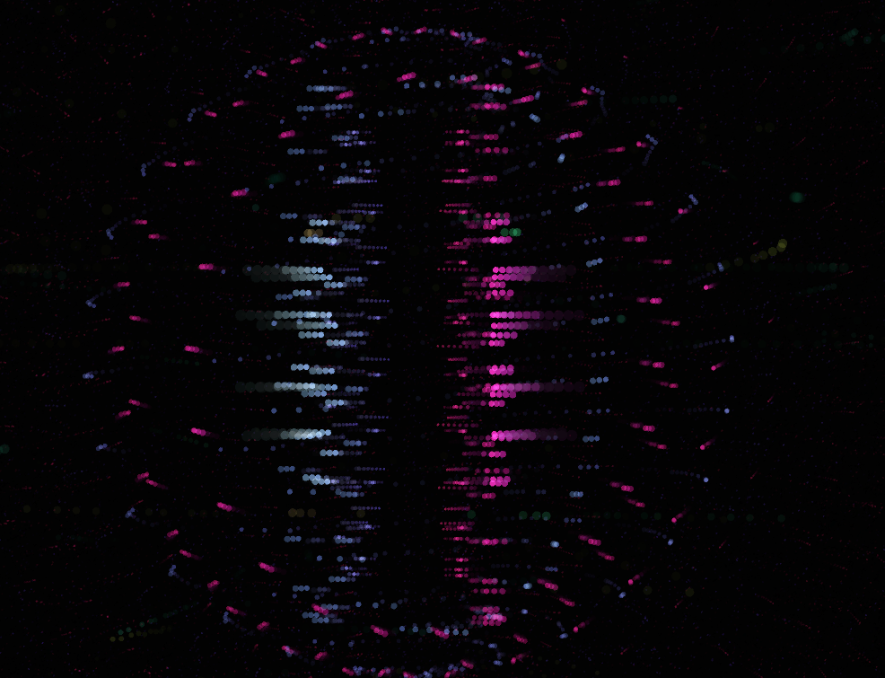
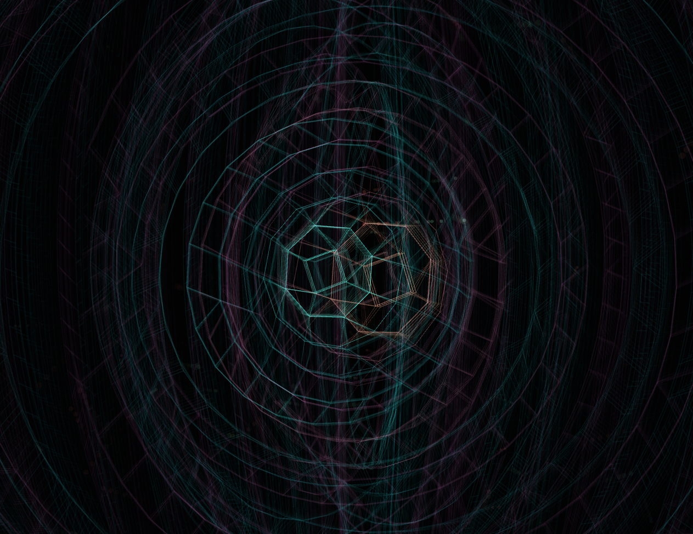

# Animus Audio Visualizer

A real-time audio visualizer built with Processing 4 featuring multiple visualization modes that respond to audio input from microphone or system audio (via virtual audio devices like SoundSource/Loopback).

<p align="center">
  
  
</p>
<p align="center">
  
  
</p>

## Features

- **3 Visualization Modes:**
  - **Vortex** - Spiral visualization with rotating frequency bands
  - **Terrain** - 3D terrain/wave grid responding to audio
  - **Droplet** - Concentric rings pulsing with audio

- **Audio Input Options:**
  - Microphone input
  - System audio via virtual audio devices (SoundSource, Loopback, BlackHole)

- **Visual Effects:**
  - Highlight, Expand, Revolve modes
  - Particle mode with GPU shaders
  - Blur and Invert options
  - Multiple camera angles with auto-panning

## Requirements

- macOS 10.14+ / Windows 10+ / Linux
- Processing 4.3+ (auto-installed by build script)

## Quick Start

```bash
# Install all prerequisites (Processing, Minim, ControlP5)
./build.sh install

# Open in Processing IDE
open Animus.pde  # macOS
```

## Manual Library Installation

If you prefer manual installation, open Processing 4 and install via **Sketch → Import Library → Manage Libraries**:

1. **Minim** - Audio analysis library
2. **ControlP5** - GUI controls library

## Running the Visualizer

1. Open `Animus.pde` in Processing 4
2. Click the Run button (▶) or press Cmd+R / Ctrl+R

## System Audio Setup (macOS)

To visualize system audio from Spotify, Apple Music, or other apps:

### Using SoundSource (Recommended)
1. Install [SoundSource](https://rogueamoeba.com/soundsource/) from Rogue Amoeba
2. In SoundSource, route your audio app's output to a virtual device
3. In Animus, select that virtual device from the audio input dropdown

### Using Loopback
1. Install [Loopback](https://rogueamoeba.com/loopback/) from Rogue Amoeba
2. Create a virtual device that captures your audio apps
3. In Animus, select the Loopback device as input

### Using BlackHole (Free)
1. Install [BlackHole](https://existential.audio/blackhole/)
2. Create a Multi-Output Device in Audio MIDI Setup including BlackHole
3. Set the Multi-Output Device as your system output
4. In Animus, select BlackHole as input

## Controls

<p align="center">
  
</p>

### Keyboard Shortcuts
| Key | Action |
|-----|--------|
| `H` | Toggle interface visibility |
| `I` | Invert colors (dark/light mode) |
| `1` | Toggle Highlight mode |
| `2` | Toggle Expand mode |
| `3` | Toggle Revolve mode |
| `4` | Toggle Particle mode |
| `B` | Toggle Blur |
| `M` | Follow mouse mode |
| `A` | Front view |
| `D` | Rear view |
| `W` | Top view |
| `S` | Auto-pan camera |
| `←/→` | Switch visualizer |
| `Space` | Pause |

### Mouse Controls
- Drag the sensitivity slider to adjust mic/audio sensitivity
- Click visualizer mode buttons to switch modes
- In follow mouse mode, move mouse to rotate view

## Building for Distribution

### macOS (Signed & Notarized)

1. **Setup credentials:**
```bash
cp env.example .env
# Edit .env with your Developer ID, Apple ID, Team ID, and app-specific password
```

2. **Build:**
```bash
./build-macos.sh
```

Or skip notarization for testing:
```bash
./build-macos.sh --skip-notarize
```

### All Platforms
```bash
./build.sh install    # Install prerequisites first
./build.sh all        # Build for all platforms
./build.sh macos      # macOS only (with signing)
./build.sh windows    # Windows only
./build.sh linux      # Linux only
./build.sh help       # Show all options
```

## Project Structure

```
animus-visualizer/
├── Animus.pde          # Main sketch, setup, UI
├── Visualizer.pde      # Base visualizer class
├── Ring.pde            # Vortex visualization
├── Fluid.pde           # Terrain visualization
├── Droplet.pde         # Droplet visualization
├── Camera.pde          # Camera control system
├── ColorTracker.pde    # Color animation
├── EPVector.pde        # Extended PVector
├── RotationTracker.pde # Rotation animation
└── data/
    ├── *.glsl          # Particle shaders
    ├── *.png           # UI assets
    └── *.ttf           # Fonts
```

## License

MIT License

## Credits

Built with [Processing](https://processing.org), [Minim](http://code.compartmental.net/minim/), and [ControlP5](http://www.sojamo.de/libraries/controlP5/).
